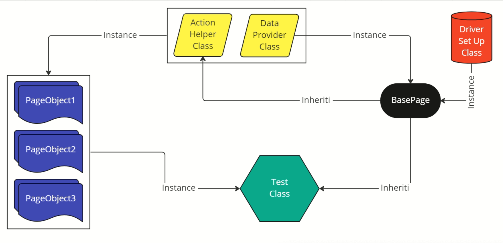

<p align="center">
  
  <h1 align="center">Maverick Automation</h1>
  <p align="center">
    This is a automation application to automate the tests from maverick
  </p>

<br />


<br />


- [About this application](#about-this-application)
    - [Technologies](#technologies)
    - [Architecture](#architecture)
- [Clone project](#clone-project)


## About this application

This application goes is to ensure quality on the Maverick project and reduce regression time

### Technologies

| Stack                                                                                      | Version |
|--------------------------------------------------------------------------------------------|---------|
| [Java](https://jdk.java.net/archive/)                                                      | 17      |
| [Selenium](https://mvnrepository.com/artifact/org.seleniumhq.selenium/selenium-java/4.6.0) | 4.6     |
| [Web driver manager](https://github.com/bonigarcia/webdrivermanager)                       | 5.3     |
| [Healenium](https://github.com/healenium/healenium-web)                                        | 3.3.1     |

### Architecture



## Clone project

To clone this project run the following command
```shell
git clone https://bbi-corp.visualstudio.com/Maverick/_git/MaverickAutomation
```